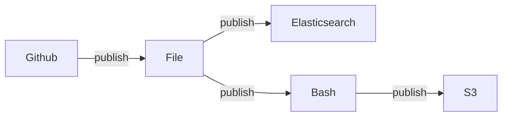

# Welcome

[](https://travis-ci.org/rpenco/light-webhook)
[](https://badge.fury.io/js/light-webhook) 
[](https://npmjs.org/package/light-webhook) 
[](https://packagequality.com/#?package=light-webhook) 

Light webhook client. Simple and light stream webhook based.  
Receives requests from Github, Gitlab, HTTP, Kafka or Syslog and executes Bash commands or send Kafka, Syslog or HTTP request

> THE LIGHT-WEBHOOK 2.0 IS IN WORK IN PROGRESS STATUS. DOCUMENTATION AND IMPLEMENTS CAN BE DIFFERENT.  
> FEATURES CAN BE MODIFIED, DISABLED OR REMOVED WITHOUT CONDITION.  
> USE LIGHT-WEBHOOK 1.0 FOR PRODUCTION USE OR CONTRIBUTE TO THIS VERSION. 

## Overview

The configuration has a generic **stream structure**.
For example you can imagine this following use case.



* An event occurred on a `Http` port where `stream` is listening to notify release file is ready.  
  The Http request body is parsed (reformatted) and forwarded as `record` to subscribed components.
* The `File` node receive `record` which contains release file information.
* `Elasticsearch` node receives enriched `record` with downloaded files
* `Bash` node receives enriched `record` (same as Elasticsearch) with downloaded files
* `S3` node receives enriched `record` with previous bash node and store file. 

Stream is configured using `yaml` syntax. You can read more about required configuration parametres following this [Configuration documentation](configuration.md).

```yaml
name: my_demo_stream             # stream name
stream:                             
    - name: github               # unique node name
      type: github-source        # specific node type
      settings:                  # specific node configuration
          # ....
      out:
        - console                # publish request body to node named console 

    - name: console              # unique second node name
      type: console-sink         # specific node type
      settings:                  # specific node configuration
          # ....
      
    # others chained nodes .....
```

When all **sink nodes succeed** or **any node failed**. Source node can sent reply.


## 🪛 Run with NPM

[NPM official page](https://www.npmjs.com/package/light-webhook).

Simply install package with `global` option.

```bash
npm install -g light-webhook@2.0.0-alpha.1
```

Then execute your configuration.

```bash
light-webhook -c test/configuration.yaml
```


## 🪛 Run with Docker

[Docker Hub official page](https://hub.docker.com/r/rpenco/light-webhook).

You can pass your configuration using `/conf/configuration.yaml` mounted volume.

```bash
docker run --name light-webhook -v $(pwd)/test/configuration.yaml:/conf/configuration.yaml -p 8080:8080 rpenco/light-webhook:2.0.0-alpha.1
```

## 🪛 Run from Tarball

Download source from [Github release page](https://github.com/rpenco/light-webhook/releases).

```bash
tar -xvf light-webhook-2.0.0-alpha.1.tgz
# (optional: set executable mode) chmod +x package/dist/light-webhook.js
./package/dist/light-webhook.js -c test/configuration.yaml
```

## 📄 Licences

MIT License